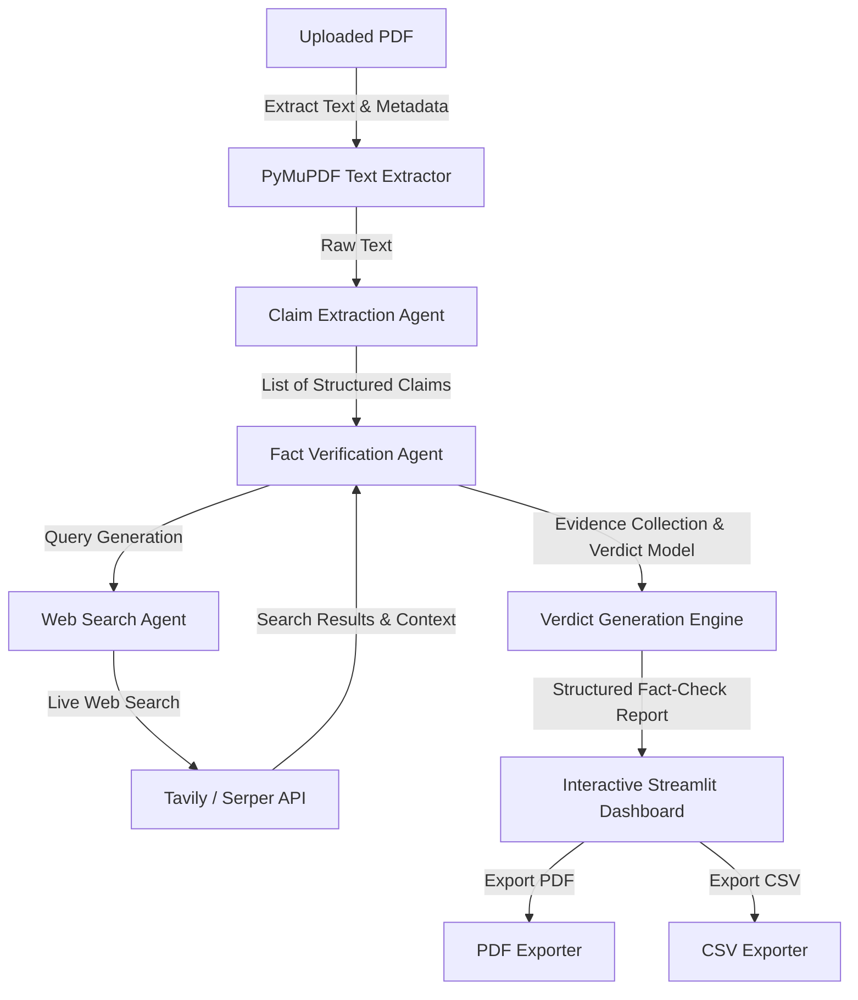

# 🛡️ Fact-Check Agent: PDF Truth Layer

Fact-Check Agent is a production-grade Python web application that acts as a real-time **Truth Layer** for PDF documents. It parses uploaded documents, isolates factual assertions (dates, figures, financial benchmarks, percentages), cross-references them against live web results via Tavily or Serper API, and scores credibility to flag incorrect or outdated claims.

---

## 🏗️ Architecture & Pipeline Flow

The system runs on a pipeline of modular LLM-based and programmatic agents:



---

## 📂 Project Structure

```
├── .github/
│   └── workflows/
│       └── ci.yml             # GitHub Actions CI/CD workflow
├── src/
│   ├── __init__.py
│   ├── models.py              # Pydantic models for claim and audit entities
│   ├── extractor.py           # PDF parsing (PyMuPDF) & Factual Claim Extraction Agent
│   ├── search.py              # Web Search wrapper (Tavily, Serper, and Simulation modes)
│   ├── verifier.py            # Fact Verification Agent & Source Credibility engine
│   └── reporter.py            # Report generation utilities (PDF and CSV exports)
├── tests/
│   ├── __init__.py
│   ├── test_extractor.py      # Extractor test suite
│   ├── test_verifier.py       # Fact verification logic tests
│   └── test_search.py         # Search query logic & fallbacks tests
├── app.py                     # Main Streamlit web dashboard
├── requirements.txt           # Project Python dependencies
├── Dockerfile                 # Docker configuration file
├── README.md                  # Main project documentation
├── deployment_guide.md        # Guide to deploy on Streamlit Cloud
└── demo_script.md             # 30-Second demo script
```

---

## ⚡ Features & Capabilities

- **Factual Claim Extraction**: Automatically ignores marketing text and extracts testable figures, financial reports, dates, percentages, and technical specifications.
- **Verification Engine**: Audits assertions against live databases, news feeds, and official company portals using Tavily/Serper Search.
- **Verdict Categorization**:
  - ✅ **Verified**: The assertion matches trusted facts and current parameters.
  - ⚠️ **Inaccurate**: The assertion contains rounding discrepancies, outdated indicators, or distorted context.
  - ❌ **False**: Direct contradiction or completely unsubstantiated.
- **Source Credibility Evaluation**: Rules-based domain analysis blended with LLM evaluation. Government `.gov` and academic `.edu` domains score higher than social media (`x.com`, `medium.com`) or blog portals.
- **Flexible Search Routing**:
  - Automatically queries **Tavily** if a key is provided.
  - Falls back to **Serper** Google Search API.
  - Runs in a dynamic **Simulation Mode** (built-in queries for GDP, Apple revenue, Population clocks) to verify flow without live API billing.
- **Export Formats**: Standard tabular `.csv` files and styled PDF reports with status badges and source hyperlinking.

---

## 🚀 Getting Started

### Prerequisites
- Python 3.11+
- Google Gemini API Key (Required for Claim Extraction & Logic)
- Tavily or Serper API Key (Optional; Simulation covers mock queries)

### 1. Local Setup
Clone the repository, configure virtual environment, and install dependencies:
```bash
# Set up virtual environment
python -m venv venv
source venv/bin/activate  # On Windows: .\venv\Scripts\activate

# Install dependencies
pip install -r requirements.txt
```

### 2. Configuration Setup
Create a `.env` file in the root directory:
```env
GEMINI_API_KEY=your_gemini_api_key_here
TAVILY_API_KEY=your_tavily_key_here
# Optional
SERPER_API_KEY=your_serper_key_here
```

### 3. Run Application
Start the Streamlit development server locally:
```bash
streamlit run app.py
```
Open [http://localhost:8501](http://localhost:8501) in your browser.

---

## 🐳 Running with Docker

Run the Fact-Check Agent in an isolated container environment:

```bash
# Build Docker image
docker build -t fact-check-agent .

# Run container exposing port 8501
docker run -p 8501:8501 --env-file .env fact-check-agent
```

---

## 🧪 Testing

Execute automated unit tests with `pytest`:

```bash
# Run tests
python -m pytest -v
```
The test suite mocks external LLM endpoints and search APIs to ensure fast, zero-dependency validation during CI checks.
